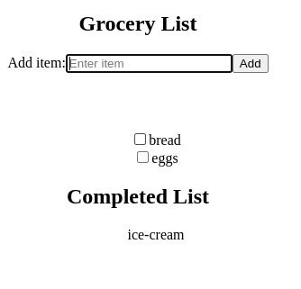

### Grocery List app

React app created using useEffect, useState and useRef hooks.
Add items by clicking on the 'Add' button.
Checking out an item will add it to the 'completed list'.
This is part of neog-camp assignment.

Preview - 

